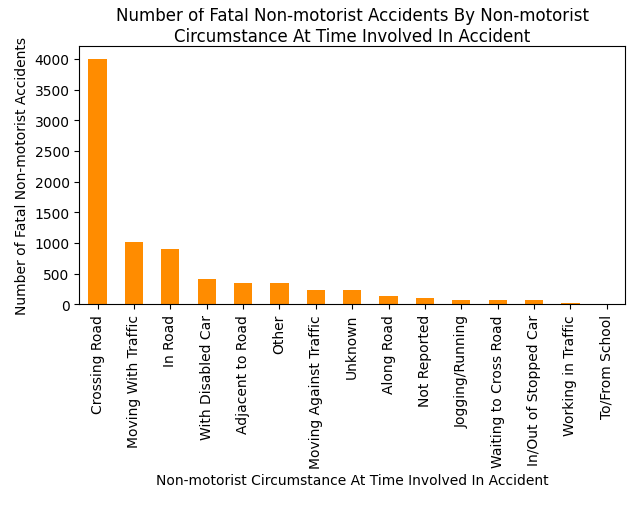

# Overview

This data analysis was done to help me expand my ability to generate and answer questions for a given data set and create graphical representations of that data.

The data set that I am analyzing comes from the US Department of Transportation Traffic Fatality Records. It details the non-motorist (someone not in the vehicle) actions and circumstances that were occurring at the time of the fatal accident and the state in which it  in 2016.

You can access the nmprior_2016 data set at [Kaggle](https://www.kaggle.com/usdot/nhtsa-traffic-fatalities?select=nmprior_2016) or [Google Cloud](https://console.cloud.google.com/bigquery?project=database-301502&p=bigquery-public-data&d=nhtsa_traffic_fatalities&t=nmprior_2016&page=table).

My purpose for writing this data analysis software is to determine what state or non-motorist actions have the most impact on the number of fatal accidents that occurred in this data set.

Here is a demo of my software: [Software Demo Video](http://youtube.link.goes.here)

# Data Analysis Results

**Question 1**: What state had the most fatal accidents involving non-motorists in 2016?

**Answer**: California

**Question 2**: What circumstances most commonly involved non-motorists in a fatal accident in 2016?

**Answer**: Crossing Roadway

# Development Environment

### **General**

* Visual Studio Code
* Python 3.8.5 32-bit
* Git / GitHub

### **Modules**

* Pandas - data structure and analysis tool
* Matplotlib - data visualization tool

# Useful Websites

* [Pandas Reference Documentation](https://pandas.pydata.org/pandas-docs/stable/reference/index.html)
* [Matplotlib Documentation](https://matplotlib.org/contents.html)

# Future Work

* Make the graphs more visually appealing and informative.
* Obtain number of accidents by pairing more than one column together when counting so that the number will be more accurate.
* Create comparison between number of people involved in the accident and the circumstances surrounding the fatality.
